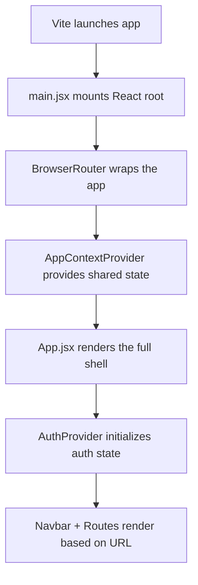
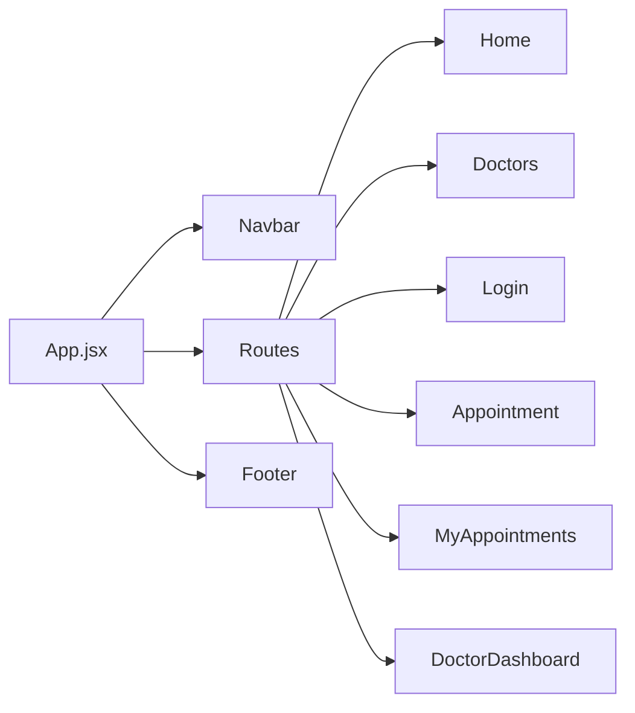
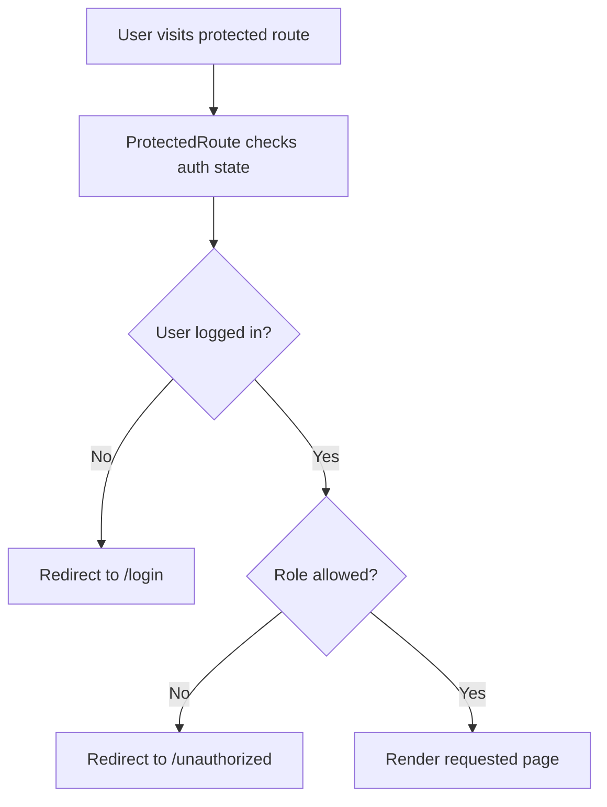
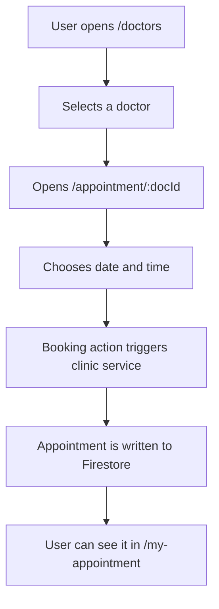
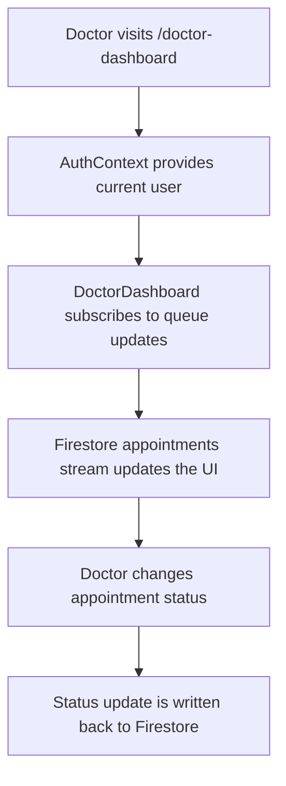

# Project Flow

This document traces how the application runs from startup through routing and page rendering.

## 1. Startup Flow

The app starts from the Vite entry point in [Frontend/src/main.jsx](Frontend/src/main.jsx).

### What happens at startup
1. Vite loads the React application.
2. [Frontend/src/main.jsx](Frontend/src/main.jsx) creates the root React container.
3. The app is wrapped in a router and a global app context provider.
4. [Frontend/src/App.jsx](Frontend/src/App.jsx) renders the base UI shell.
5. [Frontend/src/context/AuthContext.jsx](Frontend/src/context/AuthContext.jsx) begins watching Firebase authentication state.
6. The current route determines which page component is shown.

## 2. App Shell Flow

[Frontend/src/App.jsx](Frontend/src/App.jsx) is the central routing shell.

### App shell responsibilities
- renders the navigation bar at the top
- renders the route-specific page content in the middle
- renders the footer at the bottom
- wraps the app in the authentication provider
- defines the main route table

## 3. Route-to-Page Mapping

| Route | Page component | Purpose |
| --- | --- | --- |
| / | [Frontend/src/page/Home.jsx](Frontend/src/page/Home.jsx) | Landing page |
| /doctors | [Frontend/src/page/Doctors.jsx](Frontend/src/page/Doctors.jsx) | Browse all doctors |
| /doctors/:speciality | [Frontend/src/page/Doctors.jsx](Frontend/src/page/Doctors.jsx) | Filter doctors by speciality |
| /login | [Frontend/src/page/Login.jsx](Frontend/src/page/Login.jsx) | Sign up and login |
| /about | [Frontend/src/page/About.jsx](Frontend/src/page/About.jsx) | Informational page |
| /contact | [Frontend/src/page/Contact.jsx](Frontend/src/page/Contact.jsx) | Contact page |
| /my-profile | [Frontend/src/page/MyProfile.jsx](Frontend/src/page/MyProfile.jsx) | Profile page |
| /my-appointment | [Frontend/src/page/MyAppointments.jsx](Frontend/src/page/MyAppointments.jsx) | Patient appointment history |
| /appointment/:docId | [Frontend/src/page/Appointment.jsx](Frontend/src/page/Appointment.jsx) | Doctor booking experience |
| /doctor-dashboard | [Frontend/src/page/DoctorDashboard.jsx](Frontend/src/page/DoctorDashboard.jsx) | Protected doctor queue dashboard |

## 4. Protected Route Flow

Protected access is handled by [Frontend/src/components/ProtectedRoutes.jsx](Frontend/src/components/ProtectedRoutes.jsx).

## 5. Patient Booking Flow

A typical patient journey looks like this:

### Relevant files
- [Frontend/src/page/Doctors.jsx](Frontend/src/page/Doctors.jsx)
- [Frontend/src/page/Appointment.jsx](Frontend/src/page/Appointment.jsx)
- [Frontend/src/clinicService.js](Frontend/src/clinicService.js)
- [Frontend/src/page/MyAppointments.jsx](Frontend/src/page/MyAppointments.jsx)

## 6. Doctor Dashboard Flow

The doctor experience uses a live data stream:

### Relevant files
- [Frontend/src/page/DoctorDashboard.jsx](Frontend/src/page/DoctorDashboard.jsx)
- [Frontend/src/clinicService.js](Frontend/src/clinicService.js)

## 7. Overall Mental Model

The app flow is simple and layered:

1. Bootstrap the React app
2. Provide routing and global state
3. Resolve the current route
4. Render the matching page
5. Let that page use context and service functions to interact with Firebase

This makes the project feel like a small, route-driven React application with Firebase as its persistence layer rather than a large-scale enterprise architecture.
